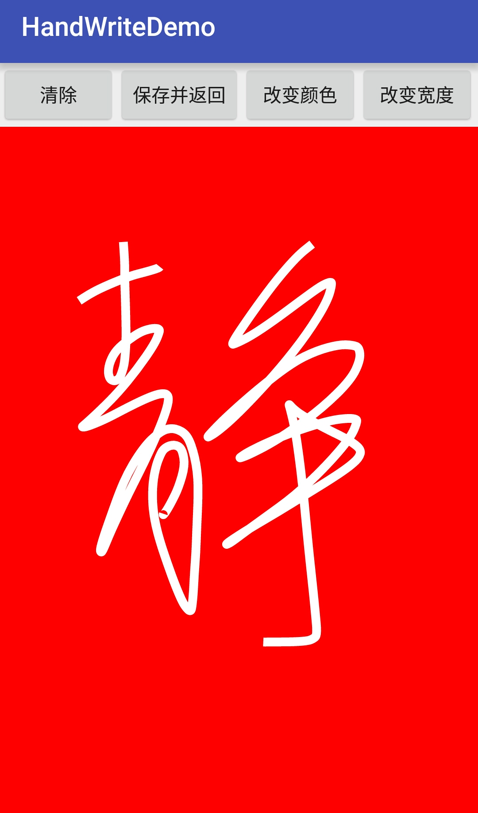

（安卓电子签名简介）E-signature for Android
============================
* 支持签名边缘裁剪
* 支持去除背景色
* 支持前景颜色或背景颜色修改


### 使用
- 添加View

```
    <com.wastrel.handwritedemo.LinePathView
        android:layout_width="match_parent"
        android:layout_height="match_parent"
        android:id="@+id/view"
        android:background="#FFFFFF" />
```
- 保存
 

```
if (mPathView.getTouched()) {
    try {
        mPathView.save("/sdcard/qm.png", true, 10);
        setResult(100);
        finish();
    } catch (IOException e) {
        e.printStackTrace();
    }
} else {
    Toast.makeText(HandWriteActivity.this, "您没有签名~", Toast.LENGTH_SHORT).show();
}

```

 
- 清除

```
mPathView.clear();
```
- 修改背景、笔宽、颜色

```
  mPathView.setBackColor(Color.RED);
  mPathView.setPaintWidth(20);
  mPathView.setPenColor(Color.WHITE);
  mPathView.clear();
```
  
###效果图




  
